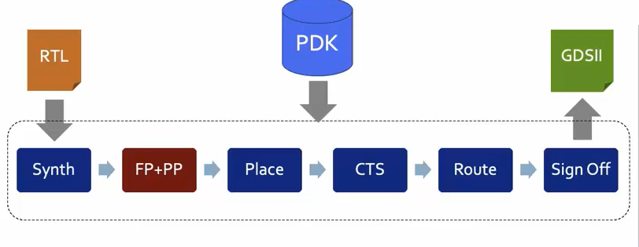
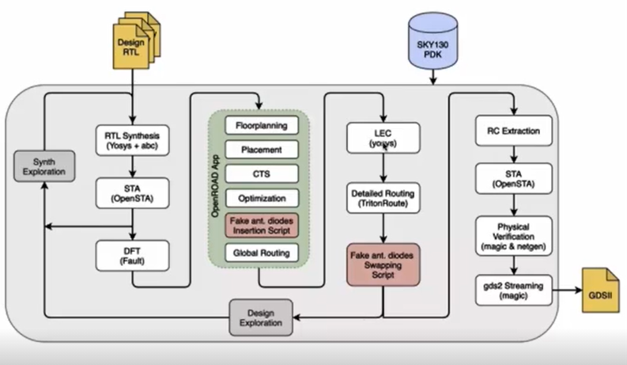
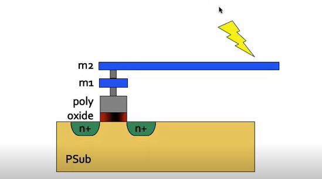
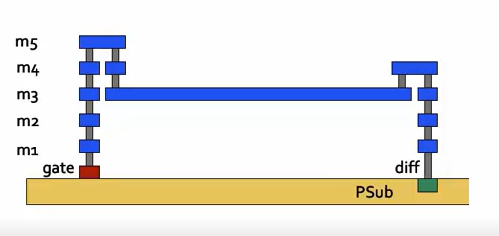
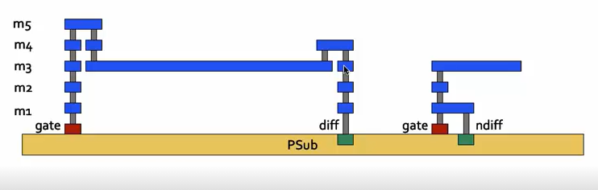

# Day 1 Inception of open-source EDA, OpenLANE and Sky130 PDK

This session focusses on the RTL to GDS flow in chip designing using various open source tools and Sky130 Open Source PDK. The flow which is being used here is the OpenLANE flow from RTL to GDS.

The simplified RTL to GDS2 flow is as given below.



Here the RTL code of the intented behaviour is converted into final GDS2 layout for fabrication.

At first the RTL code is synthesized into a netlist using the Standard cell library from Sky130 PDK. The synthesizer used is Yosys. The Gate level netlist is also tested using the same RTL test bench to avoid any synthesis errors.

After synthesis we move on to the Floor and Power Planning step.The core area of the die is calculated from the entire gate sizes which is being used in the netlist. The core region is divided into rows based on the size for the placement in the next step. The pin locations are also defined in this step.

Power planning is done to establish sufficient power supply to all the gates. A centralized power supply may result in lot of losses due to resistance when it routed to farther gates.

Next step is to place the components in the Gate level netlist in the core area based on the position of its inputs and output pins.

Now after placement we need to provide clocking mechanism to all the sequential circuits. We need to ensure that all the components receive the clock edge at the same time (lower clock slew). Clock tree synthesis is done for the above.

Since all the components are being placed and clocked we can now perform Routing of the components. The tool performs global routing and detailed routing as well.

Finally as the last step in Signing off, Physical verifications are done in layout as in Design Rule Check, Layout Vs Schematic check and Static timing analysis. Now the layout is ready to be fabricated.

<h2>OpenLANE ASIC Flow </h2>

The overflow OpenLANE flow is given below.



The synthesized RTL is checked for timing violations using OpenSTA and then automatic test pattern is being generated using Fault to test the desgin in DFT step (Design for testability).

The OpenRoad App is being used for floorplanning, Placement, Clock tree synthesis and global routing.

Having a long metallic connection in the design creates an antenna at higher frequencies causing problems in fabrication of transistor.



We can solve this we attach a higher layer on top the lengthy connection. Currently it is not supported in the tool.



We can also solve this by adding antenna diode cell to leak away the charges. We do this by adding Fake antenna diodes in the layout next to every cell input. Using Magic tool's antenna checker on the layout we can check for violation and if any found replace the fake one with real antenna diode.



Finally the Static timing analysis using OpenSTA and Physical verifications using magic and netgen is done before signing off as GDS2 layout.

<h2> Synthesis of Picorv32a RISCV processor </h2>

To start with go to the Open LANE directory and start the tool using the below commands.

```
cd work/tools/
cd openlane_working_dir
cd openlane
docker
./flow.tcl -interactive 

```

The last command is to open an interactive OpenLANE terminal.

```
package require openlane 0.9 
The above command is to import all the packages.

prep -design picorv32a
This command is for preparing the design for synthesis

run_synthesis
This command runs both yosys and abc to provide the netlist after synthesis of RTL

```

To see the results of the synthesis check in the below path of the design in openlane terminal.

/openLANE_flow/designs/picorv32a/runs/02-07_12-19/results/synthesis

Synthesis report can be found here.

/openLANE_flow/designs/picorv32a/runs/02-07_12-19/reports/synthesis


