# Day 2 Good Floor plan Vs Bad Floor plan and Introduction to library cells.

In this section we will focus on the floor planning and placement and routing of the Picorv32a processor using the OpenLANE flow. The second part of section is about the flow in the development of library cells.

<h2> Define the width and height of core and die </h2>

We start with defining the width and height of the core and die. We take for example the below circuit. The netlist is shown below.

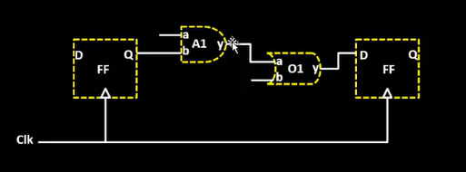

We need the area of the each gate which is being used in the netlist to define the total area of the die and core. Since in reality each gate is defined by a box of particular width and height we can represent the netlist as below.

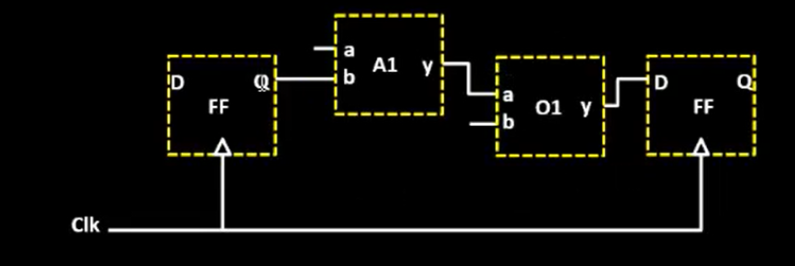

Based on the this we choose the ara of the core. We define the utilization factor as below.

Utilization Factor = Area occupied by netlist / Total area of core

<h2>Define location of Preplaced cells </h2>


Next we define the location of Preplaced cells. Since sometimes we might be using IP in certain functionalities of the design. In that case these are available as blocks to user which is unmodifiable.

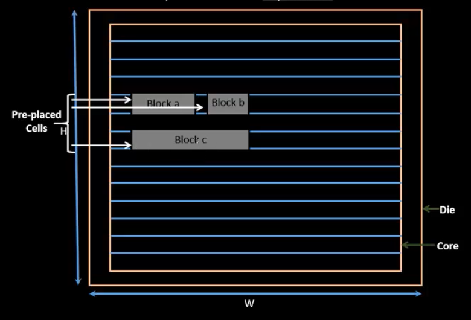

<h2>Surround preplaced cells with decoupling capacitors.</h2>

The block may have huge functionality driving lot of current. Sometimes, the current supplied may not be sufficient for the block due to resistance of the wire eventhough it is closer to supply and this may affect the voltage threshold of the gate making it work in undefined area. So we add coupling capacitors so that they charge to Supply votage and provide the necessary current needed for the block.


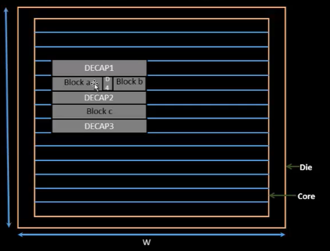

<h2> Power Planning </h2>

We cannot use a coupling capactor while connecting the driver circuit and load circuit (while connecting two circuits). So in that case due to resistance of wire the signal from driver may deterioate and may go into the forbidden region in the input of load making the load's output unpredictable.

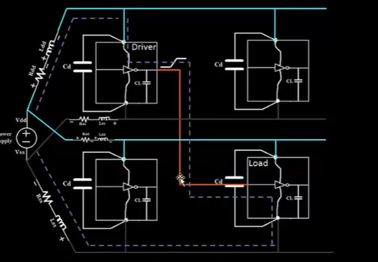

Also if the bus (red wire) is of higher bits then we have other problems as mentioned below.

For example we perform the inverting logic, the bus may be represented as a capacitor which may be charged to high or low based on boolean value.

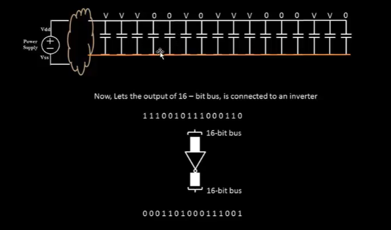

In this case at the output of inverter the 1's in input bus may be become 0 all at the same time draining a large current in the ground causing ground bounce.

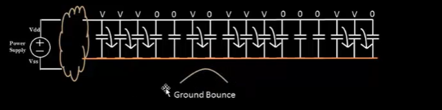

Similarily the 0's may become 1's. In this case all may be drive power at the same time causing voltage droop.

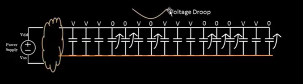


To solve all the problem we create a distributed power mesh and connect the circuits and buses to nearest power rail.

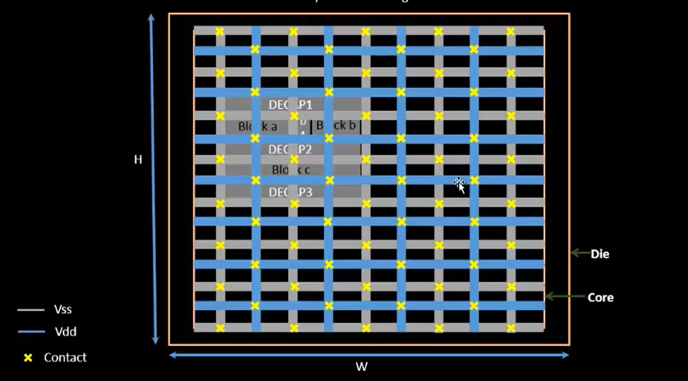

<h2>Pin Placement</h2>

Now we need to set the pin position to our layout. Here input pins are kept at left and output at right. Also clock pins are thicker as it drives the complete chip and it needs less resistance.

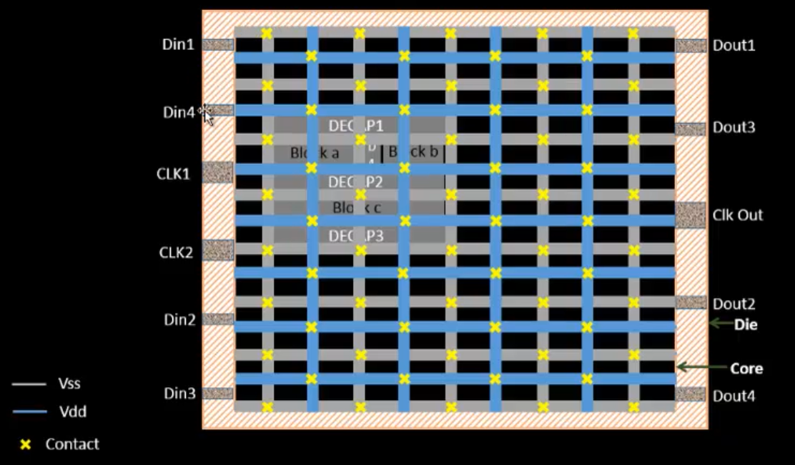

Here we also set boundary to place the components in the next step so as to avoid being placed outside the core.

To run the floorplan in OpenLANE flow

```
run_floorplan

The path of results of floorplanning
/openLANE_flow/designs/picorv32a/runs/02-07_12-19/results/floorplan

To view the floor plan
Exit open lane terminal and docker. Move to the above path and run the below command.Change the date based on the run.

magic -T /home/ramachandran/Desktop/work/tools/openlane_working_dir/pdks/sky130A/libs.tech/magic/sky130A.tech lef read ../../tmp/merged.lef def read picorv32a.floorplan.def

```

To set the configuration of floor planning, 

```
cd /openlane_working_dir/openlane/designs/picorv32a

```

Now we set the parameters for synthesis. We set the utilization factor to be 65%.

The priority of configuration files goes by, in the designs/picorv32a folder the highest priority being 
sky130A_sky130_fd_sc_hd_config.tcl,then config.tcl and the least priority being the openlan floorplan.tcl in the directory ~/openlane_working_dir/openlane/configuration/floorplan.tcl

```
vi ~/openlane_working_dir/openlane/designs/picorv32a/sky130A_sky130_fd_sc_hd_config.tcl

change the utilization factor to 65%

```
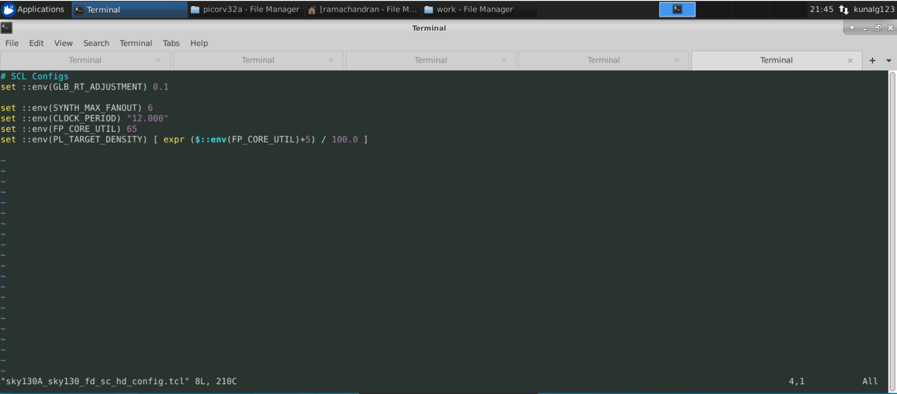

After running the floor planning we can find the results in below file

```
~/Desktop/work/tools/openlane_working_dir/openlane/designs/picorv32a/runs/03-07_16-08/config.tcl

```
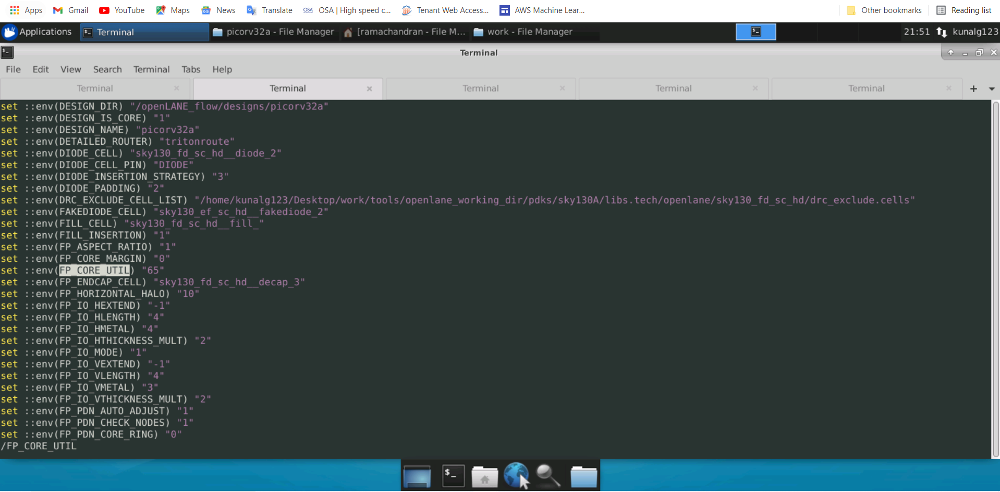


On viewing in magic we get as below

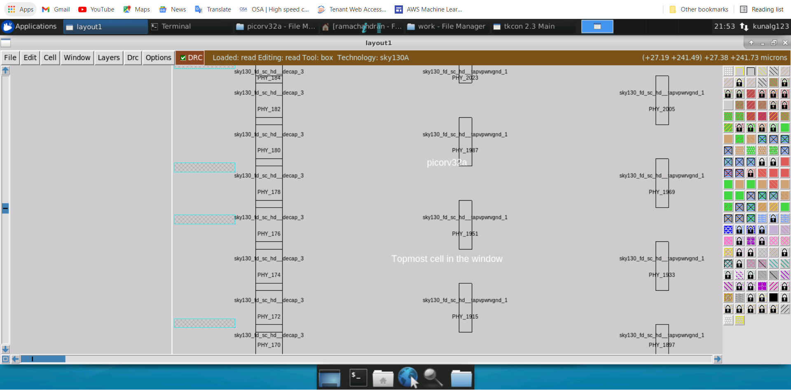

<h2>Placement and Routing </h2>

We first bind the gates in the netlist with the corresponding standard cells from PDK. Now we place them onto the floor plan within the boundaries and outside the region of pre placed blocks.

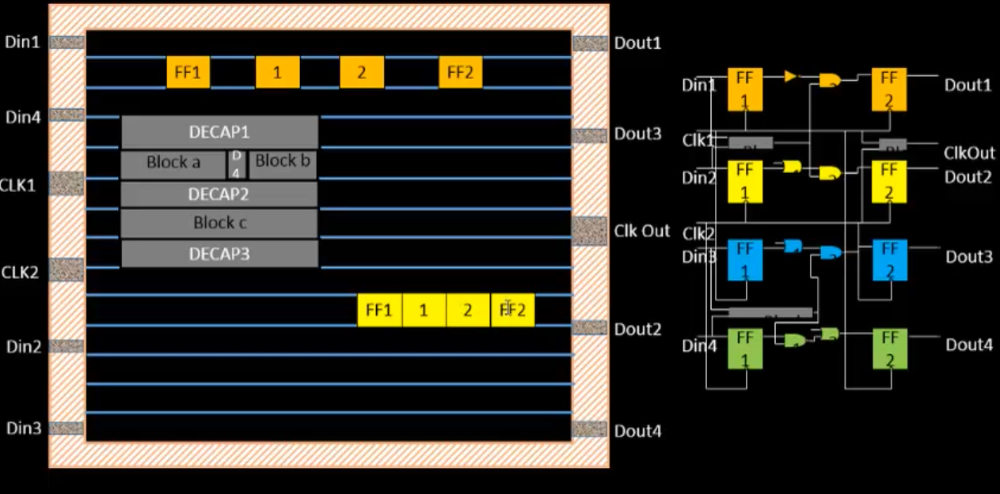

The run_placement command runs both global and detailed placement.

Sometimes there may be an error after placement Reducing the utilization to 50% resolved it.

```
In Openlane terminal
run_placement

To view the results.

cd ~/Desktop/work/tools/openlane_working_dir/openlane/designs/picorv32a/runs/03-07_17-01/results/placement

magic -T /home/ramachandran/Desktop/work/tools/openlane_working_dir/pdks/sky130A/libs.tech/magic/sky130A.tech lef read ../../tmp/merged.lef def read picorv32a.placement.def

```

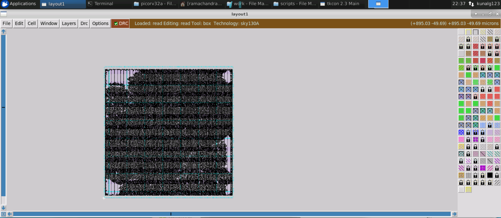


<h2>Standard Cell Design Flow </h2>

Sometimes we may need to design our own cell depending on the application when the usage of standard cell is not suitable for our needs. So in this section we will discuss the standard cell design flow.

The cell design flow consists of below steps.

<OL>
<LI>Inputs </LI>
<UL>
<LI>PDS's from foundry</LI>
<LI>DRC and LVS rules of the foundry</LI>
<LI>Spice models </LI>
<LI>Library and user defined specifications </LI>
</UL>
<LI>Design Steps </LI>
<UL>
<LI>Circuit design</LI>
<LI>Layout design </LI>
<LI>Characterization </LI>
</UL>
<LI>Outputs </LI>
<UL>
<LI>Circuit description language (CDL)</LI>
<LI>GDS2 layout </LI>
<LI>LEF </LI>
<LI> Extracted spice netlist (.cir)</LI>
</UL>
</OL>
