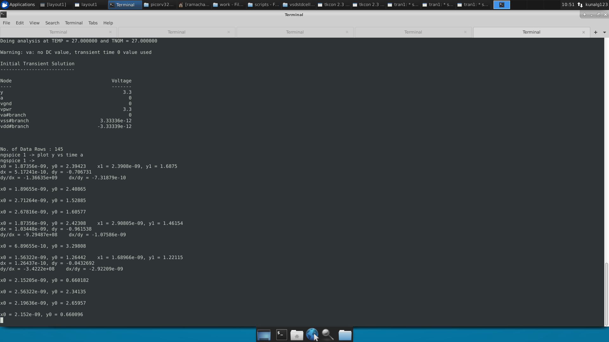

# Day 3 - Design and characterize one library cell using Magic Layout tool and ngspice

In this section we will focus on the design of standard cell and its simulation. We will use an inverter as an example here.

We begin with downloading the inverter layout in magic from the below repo.

```
cd /home/ramachandran/Desktop/work/tools/openlane_working_dir/openlane

git clone https://github.com/nickson-jose/vsdstdcelldesign.git
```

Now go to the extracted folder to view the layout in magic use the below command.

```
cd vsdstdcelldesign
Now place the sky130A.tech file in this directory.

Path of tech file
/home/ramachandran/Desktop/work/tools/openlane_working_dir/pdks/sky130A/libs.tech/magic/

To open the layout using magic

magic -T sky130A.tech sky130_inv.mag &

```


<br/><br/>


<br/><br/>


From the layout to perform the simulation we now need to extract the layout into spice netlist. We use the below commands for that.

```
In the Tkcon magic's terminal.

extract all
Creates .ext file in the same folder

ext2spice cthresh 0 rthresh 0
ext2spice

Creates a .spice file

```


To simulate using ngspice we need to modify some items of the extracted spice netlist.

We first scale the file based on the grid size in our layout. For that we got to our inverter layout in magic
Window -> Grid on
Zoom in and select a grid by pressing left mouse on top left corner of grid and right mouse at bottom right corner.

After selecting, use command box in tkcon terminal to get the size of the selection.


Edit the spice file as below.


We perform transient analysis of the inverter by giving a pulse input of total time being 4ns and 2ns for high signal.

```
ngspice sky130_inv.spice
In ngspice terminal

plot y vs time a
```


<h2> Characterization of the inverter cell </h2>

<h3>Rise time </h3>

The time required for the ouput to reach 80% of Vdd from 20% of Vdd is called as rise time.



In last two values of the image the first time value is for 80% and second is for 20%. So the rise time is 44ps.

<h3>Propagation delay while Rise</h3>

The time required for the output to reach 50% of Vdd from 0 value when the input changed to 50% of Vdd.


In last two values of the image the first time value is for input 50% and then output 50%. The rise delay is 2.87 ps.

<h3>Fall time </h3>

The time required for the ouput to reach 20% of Vdd from 80% of Vdd is called as Fall time.


In last two values of the image the first time value is for 80% and second is for 20%. So the rise time is 2.11ns.

