# Day 4 - Pre-layout timing analysis and importance of good clock tree

In this section we will cover the steps involved in using our custom inverted standard cell into our Picorv32a processor.

Now we have simulated the inverter characteristics, the next step is to add it to our picorv32a design flow. For that we need a .lef file. We need to convert our layout in Magic to .lef file. 

Now we change the grid size based on the Li layer dimension to satisfy the rules for convert into .lef file.

To get the Li layer dimensions check the below file

~/Desktop/work/tools/openlane_working_dir/pdks/sky130A/libs.tech/openlane/sky130_fd_sc_hd/tracks.info

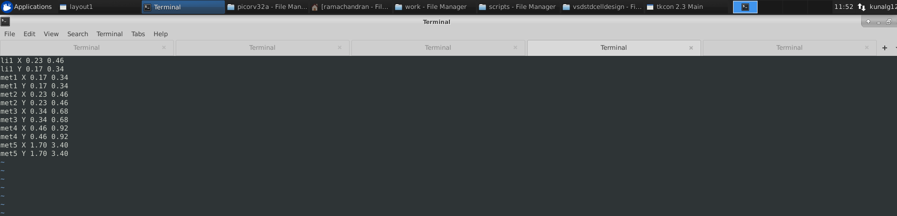

```
In tkcon terminal
grid 0.46um 0.34um 0.23um 0.17um

```
We converge grid with track value to match the rules using the above command.

The rule here is that the input and output port must be in intersection of horizontal and vertical track.

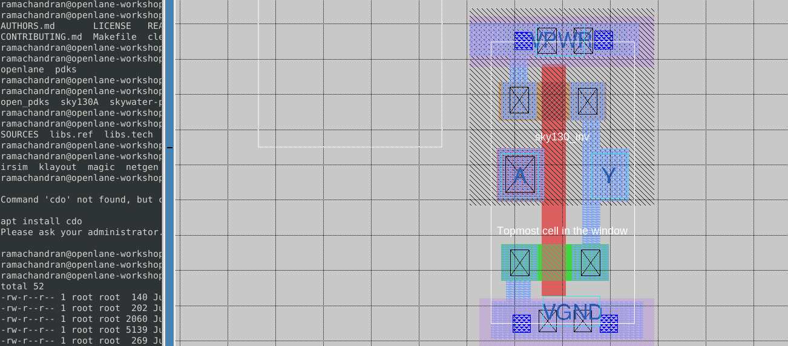

The width of standard cell should be in odd multiples of x pitch of Li1 layer. The inner box denotes the standard cell area and not the outer white box. Here we have a width of 3 boxes.


The height of standard cell should be in odd multiples of y pitch of Li1 layer. The inner box denotes the standard cell area and not the outer white box.

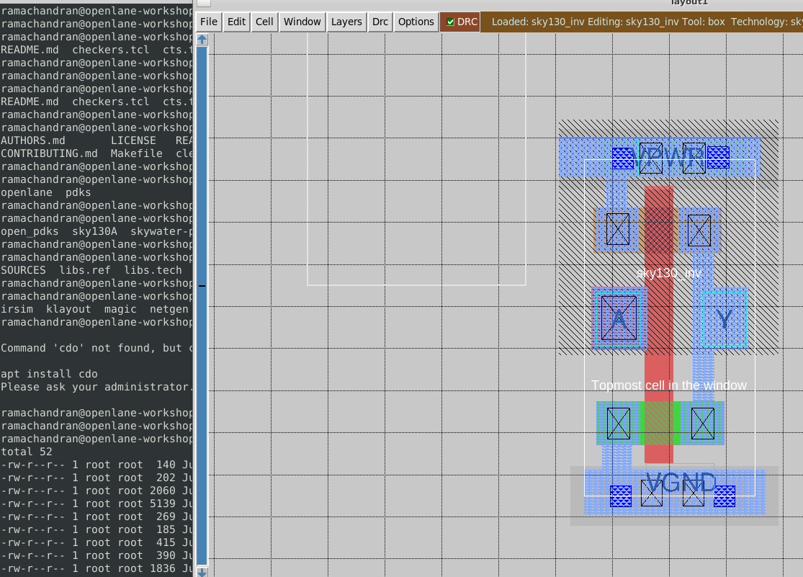

The port labeling is done. Setting a layer as a port declares pin of the macro in the .lef file.

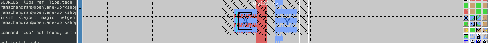

<br/> 

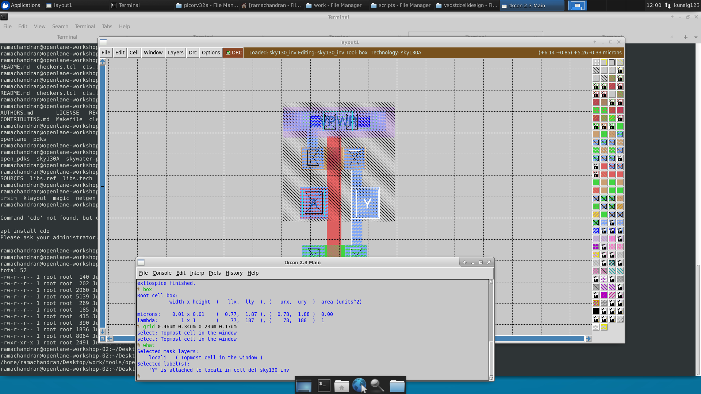


To extract the LEF file from the layout.

```
In tkcon terminal
lef write
```

Copy this .lef file and put inside our designs/picorv32a/src folder.

Also copy the sky130 fast,slow and typical lib file and sky130A tech file to our designs/picorv32a/src folder


Now edit the config.tcl to use the lef file and our lib files.

```
Path of config.tcl
~/Desktop/work/tools/openlane_working_dir/openlane/designs/picorv32a/config.tcl

```
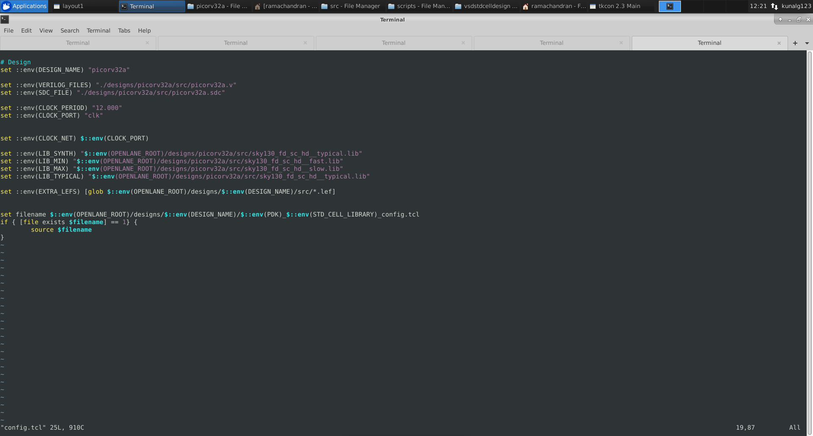


Now go back to openlane directory and perform all the steps.

```
docker
./flow.tcl -interactive 
package require openlane 0.9
prep -design picorv32a -tag 04-07_07-11 -overwrite

set lefs [glob $::env(DESIGN_DIR)/src/*.lef]  
add_lefs -src $lefs
run_synthesis

```

This has a very high slack violation after synthesis.

```
Chip area for module '\picorv32a': 147950.646400

set_load  $cap_load [all_outputs]
tns -3232.44
wns -26.53
[INFO]: Synthesis was successful
% echo $::env(SYNTH_STRATEGY)
AREA 0

```
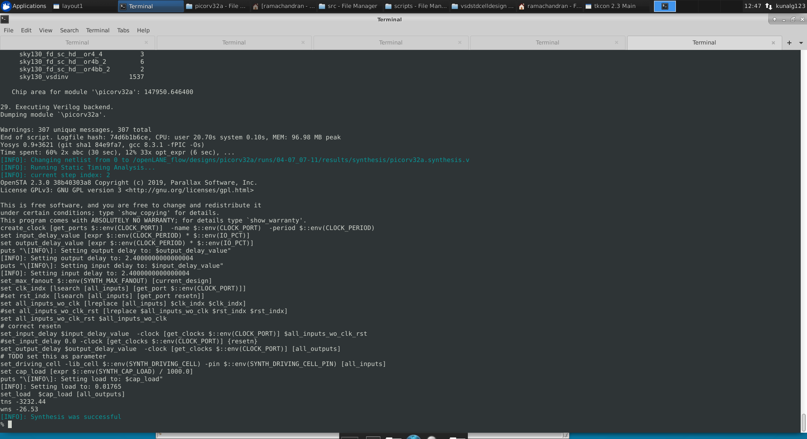

We try to reduce the slack by modifying the below parameters.

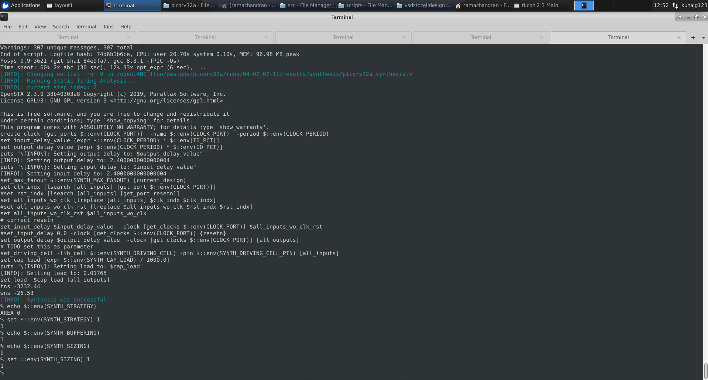

```
Chip area for module '\picorv32a': 209179.369600

set_load  $cap_load [all_outputs]
tns -266.36
wns -2.95

```
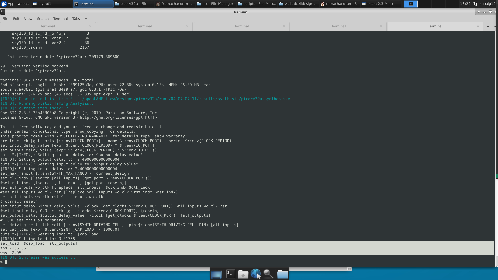


Static Timing analysis

Now we perform timing analysis of our Picorv32a using our standard cell inverter. This is used to find out the slack of our synthesized netlist.

Copy the my_base.sdc file from /home/ramachandran/Desktop/work/tools/openlane_working_dir/openlane/vsdstdcelldesign/extras/my_base.sdc to our designs/picorv32a/src
This is from inverter layout folder.

Now create a pre_sta.conf file in openlane folder and enter as below.
~/Desktop/work/tools/openlane_working_dir/openlane$ vi pre_sta.conf

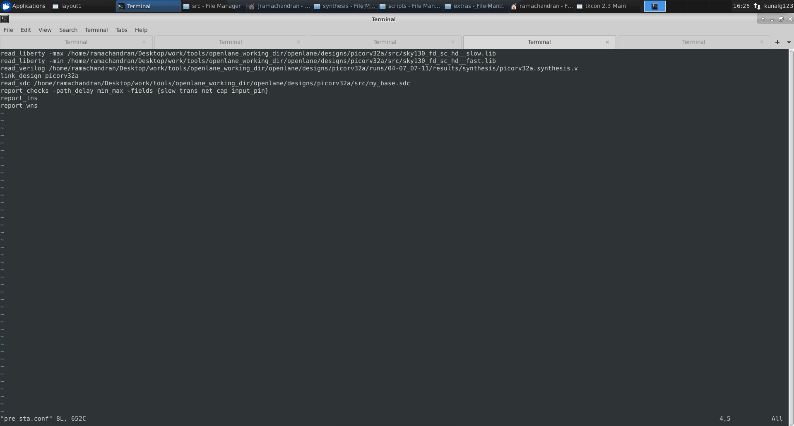


```
Run STA as
sta pre_sta.conf
```


Now we try to reduce the slack we set the SYNTH_MAX_FANOUT to 4 and run_synthesis.

```
CoreArea: 
5520.000000 : 10880.000000 - 650900.000000 : 655520.000000
tns -274.40
wns -3.02

```

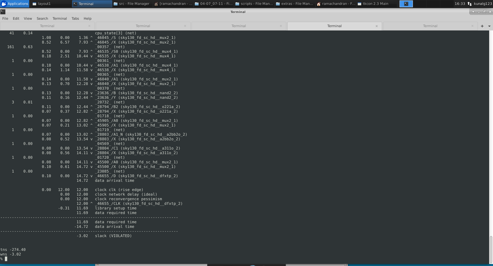

Clock Tree Synthesis :

The clock tree synthesis is performed to facilitate the clock to all the sequential components with lesser slew. We perform using the below commands.

```
In open lane console
After synthesis we follow the below commands
init_floorplan
place_io
global_placement_or
detailed_placement
tap_decap_or
detailed_placement
run_cts

```

We can see our custom inverter being used in the synthesized file as below.

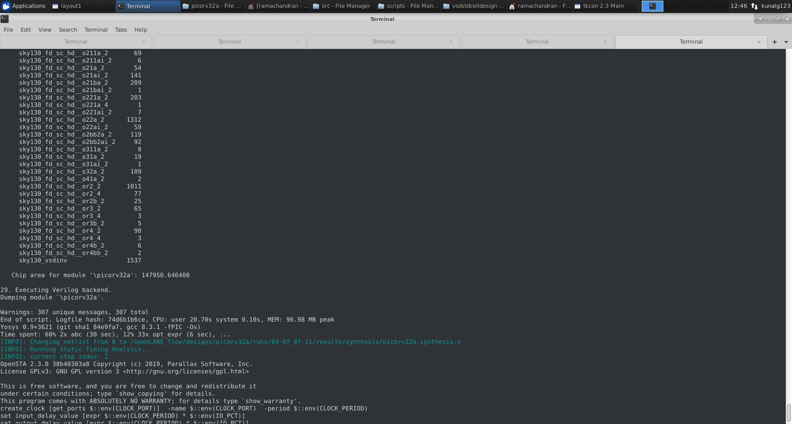

This creates a _cts.v file as below. This is the new synthesized file and we need to use this for further processes in flow.

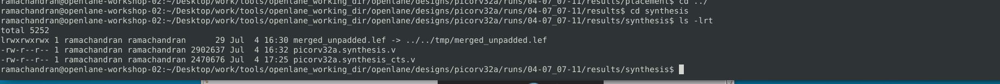

On opening the layout in magic we see the below.

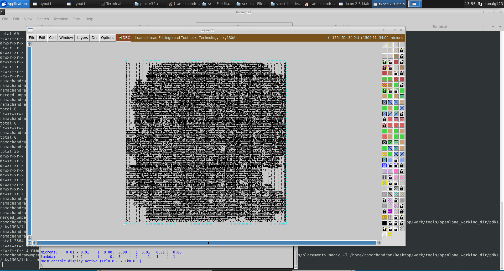

<h2> Clock Tree Synthesis </h2>

The clock needs to be connected to all the sequential elements in our design. So it must be routed all over the ciruict.

For example if we route the circuit as below.

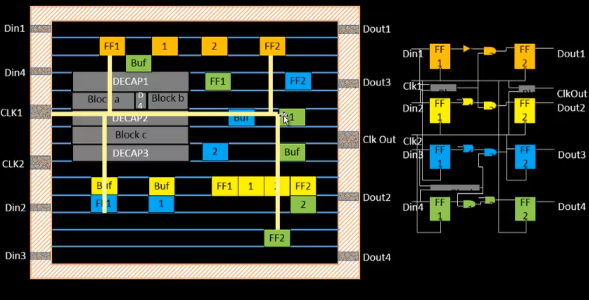

The problem here is that clock can reach the near end and far end circuit at different time depending on length of wire.So to solve this we must ensure that clocks wire distances are equidistant but using various clock routing algorithms namely HTree which is being used here.

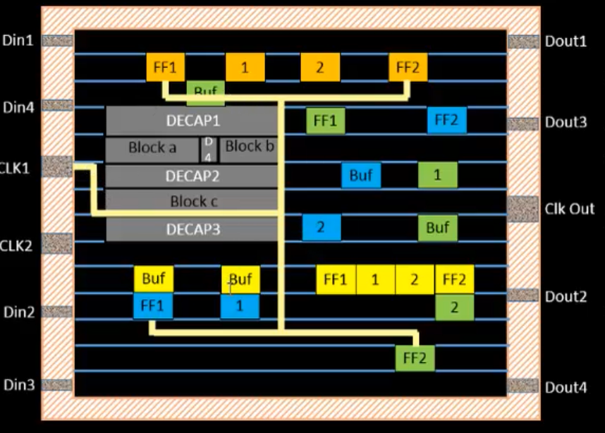

This ensures the FF1 and FF2 clock wires are equidistant and thereby decreasing the skew to negligible.

The problem with the above routing is that due to length of wires there will be resistance and capacitances causing the signal to decay thereby increasing the slew of clock.

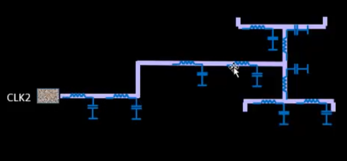

So to protect signal integrity we add buffers in middle as below.

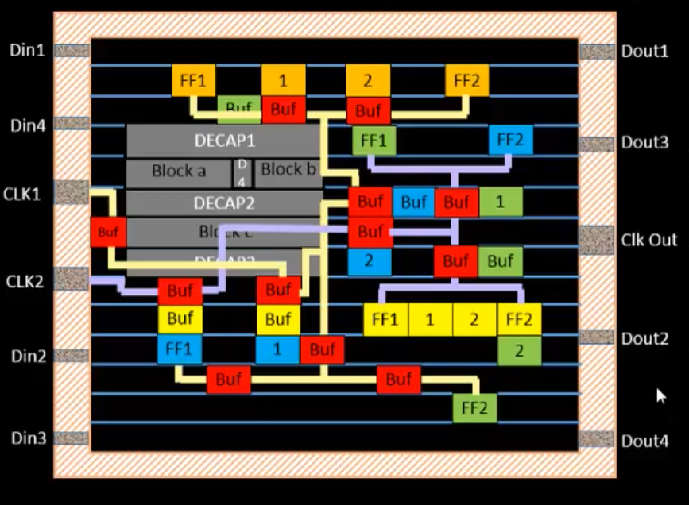


Sometimes due to cross talk between two clock lines we may experieces unwanted signal in one circuit. This is called glitch.

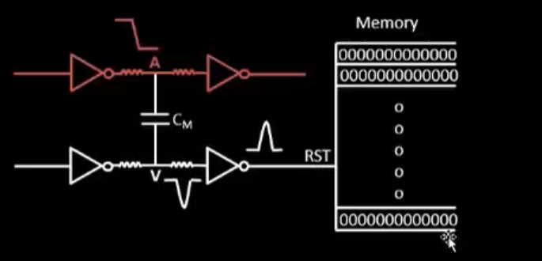

In this example the clock transistion is coupled by the capacitor CM due the capacitance effects between two parallel wires causing 0 to 1 transition as above. This causes the total reset of memory which is dangerous.

To solve this problem we shield the clock wires.

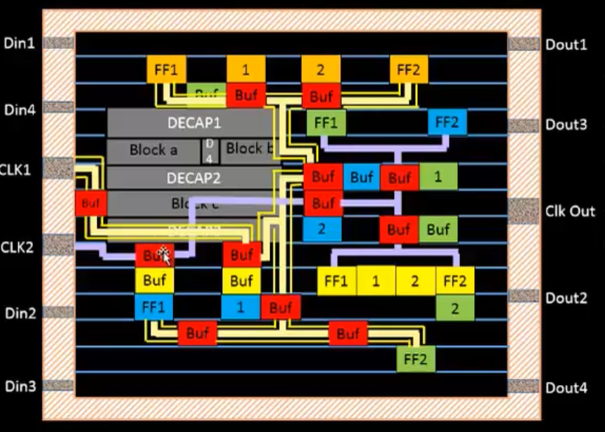

The Cross talk can impact the skew of the clock signal affecting the setup time equation.

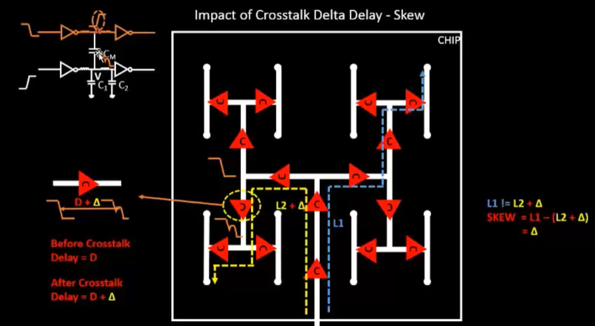

The Skew is increased by a factor of delta due to cross talk creating a bump due to capacitive coupling betwee two parallel wires.

In this case clock shielding helps.
