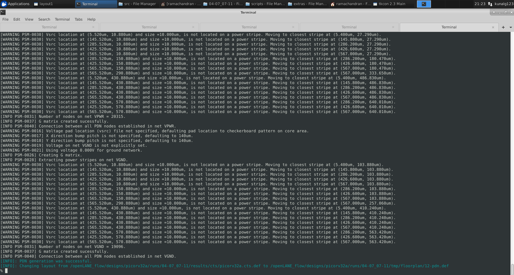
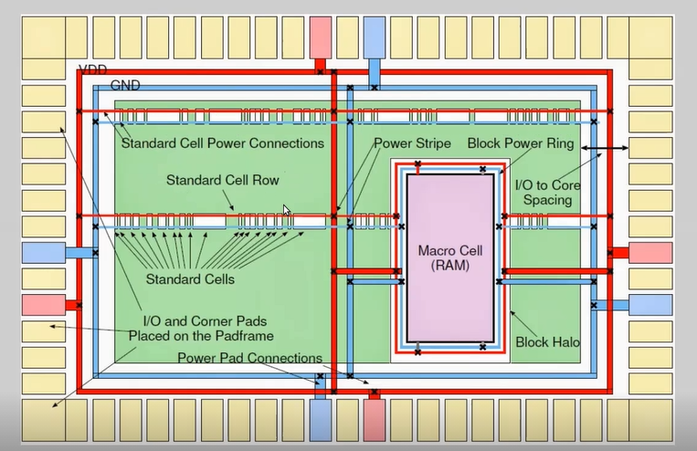
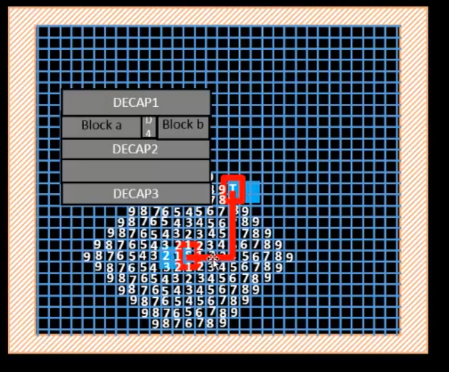
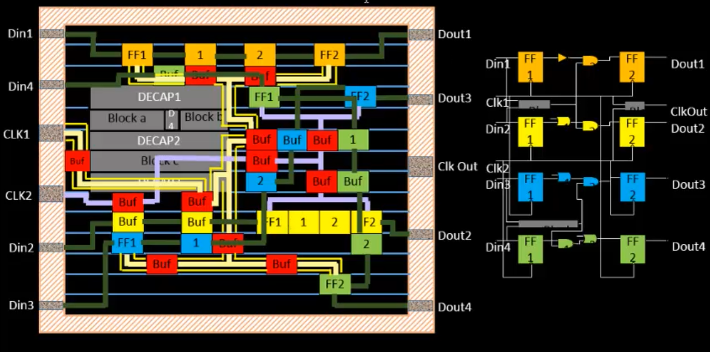

# Day 5 - Final steps for RTL2GDS

In this section we will focus on completing the RTL to GDS2 by making the power distribution network and finally routing all the components.

We begin by making the power distribution network as below.



```
To do 
gen_pdn

```

The reason of using standard length length and heigh in odd multiples of Li1 layers is that the standard cell can fit properly between the power and ground lane rows as below. 



The power rails are connected to the power pads of the processor.

<h2> Routing </h2>

We use Lee's algorithm to perform the routing process. The algorithm divides the area into grids. It numbers the grid starting from source based on levels. The algorithm only supports horizontal and vertical movements.



The algorithm after reaching the target finds the path back to the source by choosing the path with minimum turns.

```
The routing is perfomed by
run_routing

```

We have chosen routing strategy as 0 amount 0,1,2,3 and 14. Routing 0 is a simple and fast strategy. Routing 14 has better optimization, but it takes more time.

